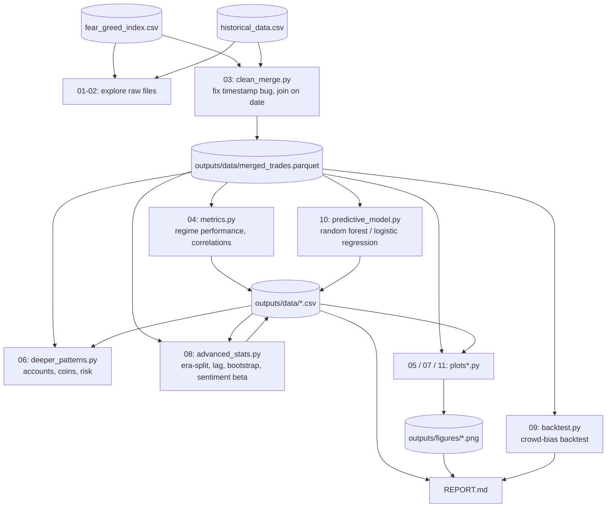
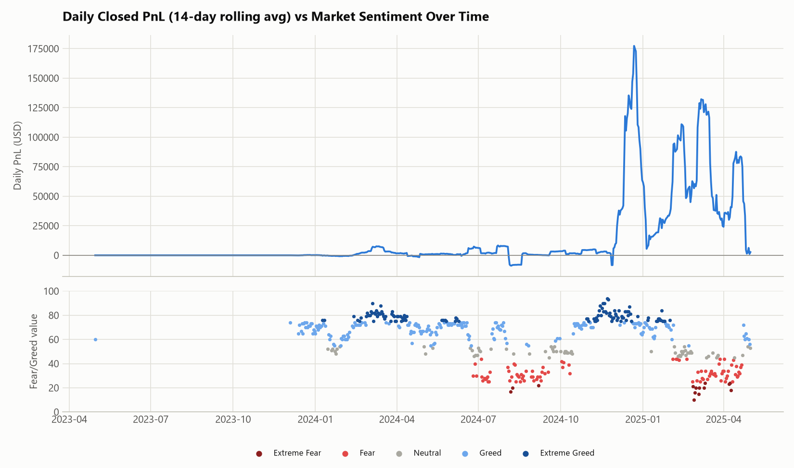

# Trader Performance vs. Market Sentiment — Analysis

Explores the relationship between Hyperliquid trader performance and the Bitcoin
Fear & Greed Index: regime-level performance metrics, robustness checks (era-split,
lagged correlation, bootstrap CIs), a crowd-bias correctness backtest, and a
predictive model with feature importance.

**Start here → [REPORT.md](REPORT.md)** for the full write-up: methodology, charts, and strategy recommendations.

## Headline result

| Sentiment | Win Rate | Profit Factor | PnL per $ traded |
|---|---:|---:|---:|
| Extreme Fear | 78.4% | 2.8x | 92 bps |
| Fear | 86.7% | 5.5x | 59 bps |
| Neutral | 80.1% | 4.9x | 68 bps |
| Greed | 78.5% | 3.2x | 91 bps |
| **Extreme Greed** | **88.9%** | **10.3x** | **206 bps** |

Extreme Greed is this cohort's best-performing regime by every efficiency metric — the opposite of the "buy fear, sell greed" folk wisdom. Full detail, caveats, and a backtest of what that implies for position sizing are in [REPORT.md](REPORT.md).

## Pipeline



## Sample output

| | |
|---|---|
|  |  |
|  |  |

All 14 charts are in [`outputs/figures/`](outputs/figures/), referenced inline throughout [REPORT.md](REPORT.md).

## Project layout

```
├── fear_greed_index.csv         raw sentiment data (given)
├── historical_data.csv          raw Hyperliquid trade data (given)
├── requirements.txt             Python dependencies
├── REPORT.md                    full findings + strategy recommendations
├── README.md                    this file
├── notebooks/                   analysis scripts, run in order
│   ├── 01_explore.py            initial look at both raw files
│   ├── 02_explore_time.py       diagnose the timestamp columns
│   ├── 03_clean_merge.py        clean, align timezones, merge -> outputs/data/merged_trades.parquet
│   ├── 04_metrics.py            core performance metrics by sentiment regime
│   ├── 05_plots.py              primary charts
│   ├── 06_deeper_patterns.py    per-account, per-coin, concentration & risk checks
│   ├── 07_plots_extra.py        remaining charts
│   ├── 08_advanced_stats.py     era split, lagged correlation, Kruskal-Wallis, bootstrap CIs, sentiment beta
│   ├── 09_backtest.py           crowd-bias correctness check + simple sizing/skip backtests
│   ├── 10_predictive_model.py   random forest / logistic regression, feature importance for win prediction
│   └── 11_plots_advanced.py     charts for 08-10
└── outputs/
    ├── data/                    cached CSV/parquet outputs from the scripts above
    └── figures/                 all PNG charts referenced in REPORT.md
```

## Reproducing

Run from the project root (the scripts read `fear_greed_index.csv` / `historical_data.csv` and write to `outputs/` using relative paths):

```bash
pip install -r requirements.txt
python notebooks/01_explore.py
python notebooks/02_explore_time.py
python notebooks/03_clean_merge.py
python notebooks/04_metrics.py
python notebooks/05_plots.py
python notebooks/06_deeper_patterns.py
python notebooks/07_plots_extra.py
python notebooks/08_advanced_stats.py
python notebooks/09_backtest.py
python notebooks/10_predictive_model.py
python notebooks/11_plots_advanced.py
```

Each script prints its findings to stdout and/or writes to `outputs/`.
