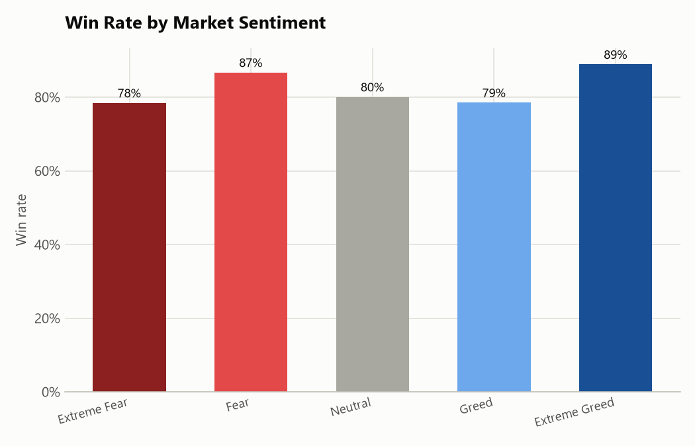
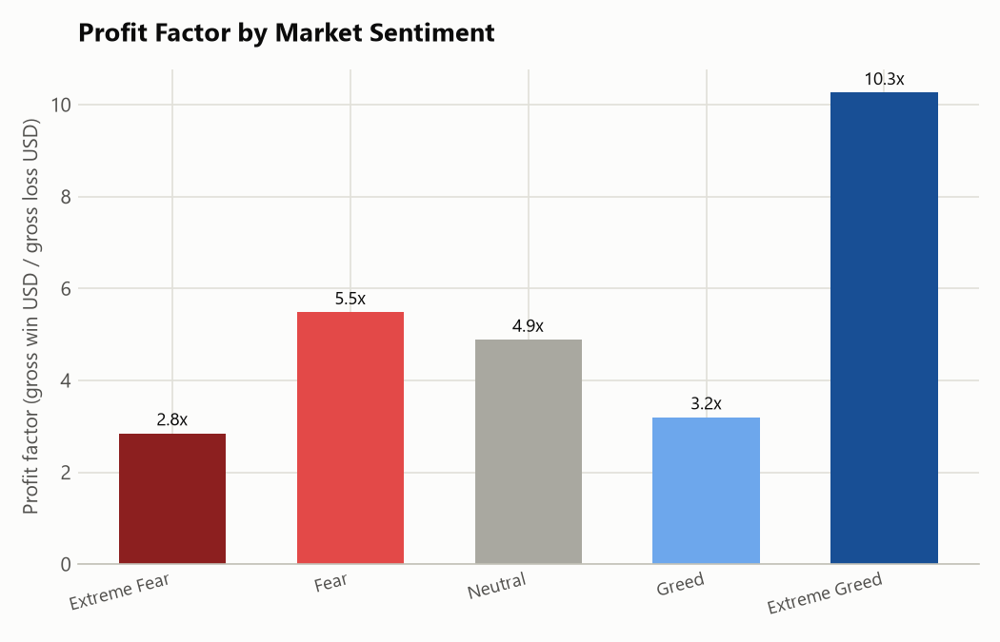
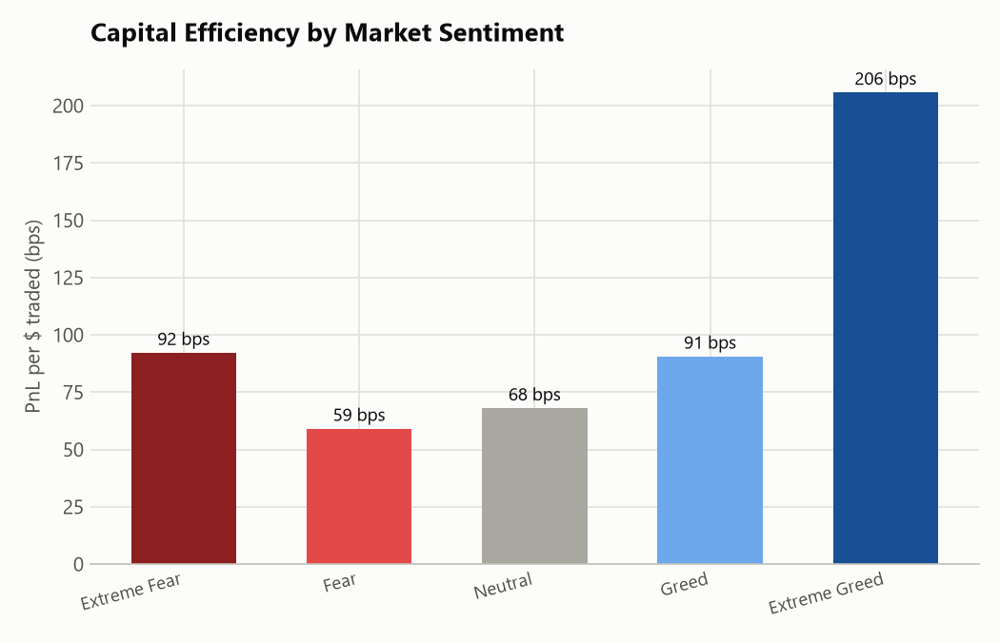
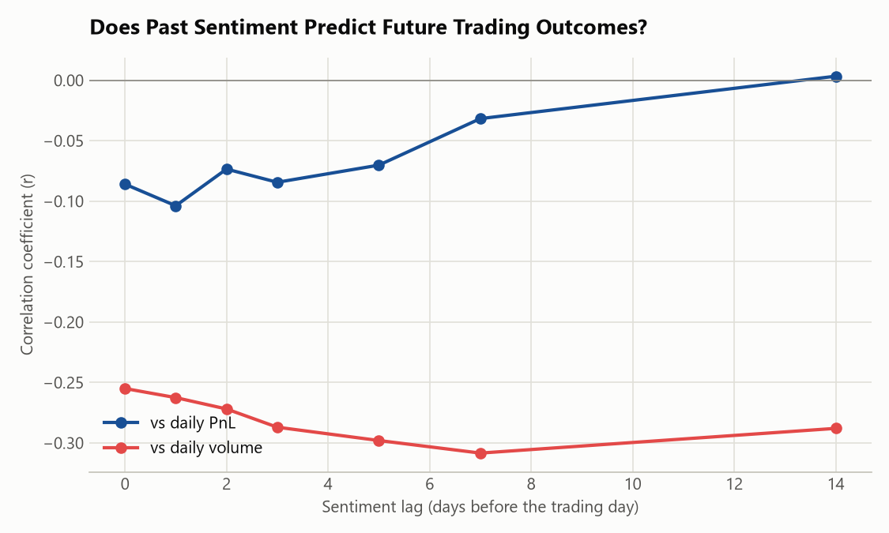
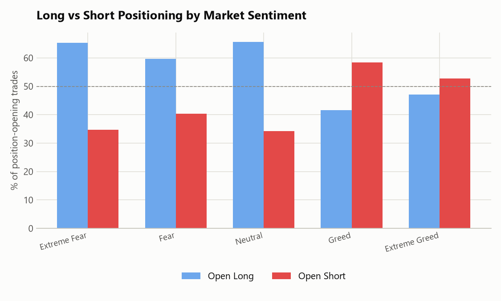
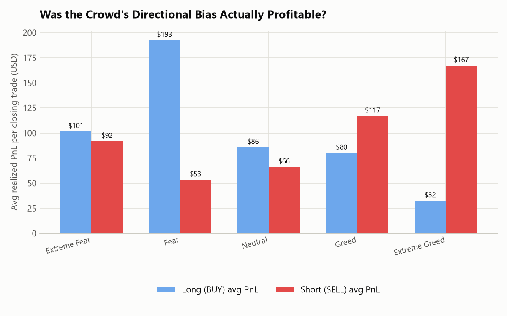
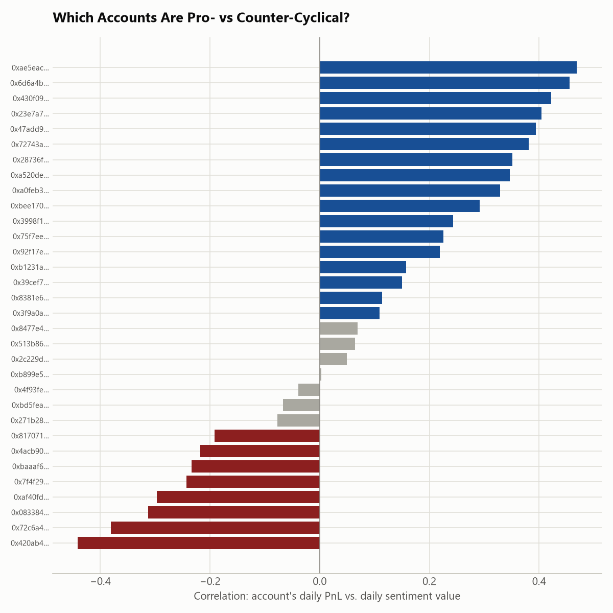
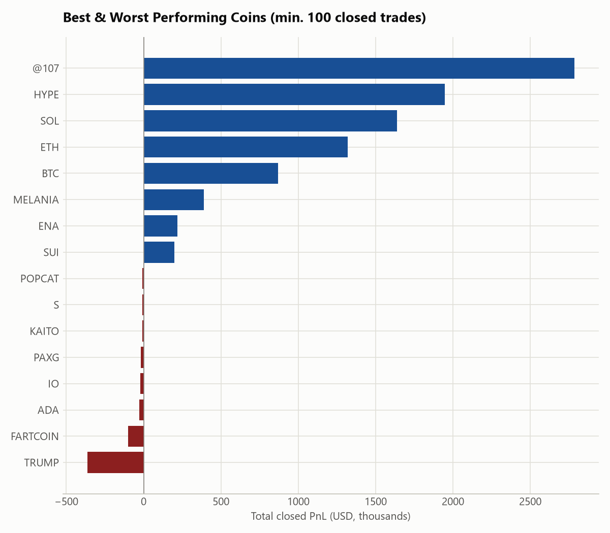
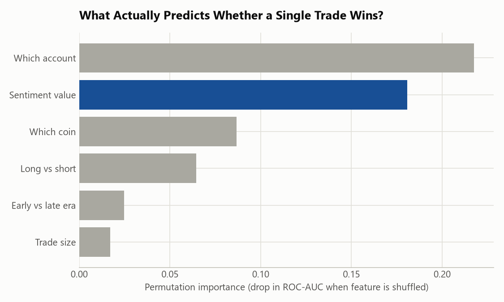

# Trader Performance vs. Bitcoin Market Sentiment

Two datasets: the daily Bitcoin Fear & Greed Index (2,644 days back to Feb 2018) and 211,224 individual trade fills from 32 Hyperliquid accounts trading 246 different coins between April 2023 and May 2025. The brief was open-ended: find the relationship between trader performance and sentiment, look for patterns, come back with something a trading desk could act on. Below is what I found, how I checked it, and where I think the results are solid vs. where they're shaky.

Code is in `notebooks/`, run in numeric order (01 through 11). Intermediate outputs land in `outputs/data/`, charts in `outputs/figures/`.

## Getting the data into shape

First problem: the trades file has two timestamp columns and they disagree with each other by anywhere from -1,384 to +1,392 hours. Turned out the epoch-millisecond column had been through an Excel round-trip at some point and lost precision, so thousands of distinct trades all collapsed onto the same rounded value like `1.73E+12`. The `Timestamp IST` string column didn't have this problem, so I used that instead, shifted it from IST to UTC, and joined it against the sentiment index on date. Every single trade matched to a sentiment label, no gaps, since the trading window sits entirely inside the sentiment window.

Second thing worth flagging up front: the trade rows include both position-opening fills (`closed_pnl = 0` by construction) and closing fills that realize PnL. All the win-rate / profit-factor / avg-PnL numbers below are computed only on the closing fills, otherwise you're diluting the stats with a pile of zeros that don't mean "breakeven."

Third: sentiment activity in this window is lopsided. Extreme Fear only happened on 14 of the 476 days that had any trading at all, versus 197 days of Greed. I kept that in mind throughout and checked it doesn't drive the conclusions on its own (see the bootstrap section below).

## How performance breaks down by sentiment regime

| Sentiment | Trades | Closes | Volume | Win Rate | Avg PnL/close | Profit Factor | PnL per $ traded |
|---|---:|---:|---:|---:|---:|---:|---:|
| Extreme Fear | 21,303 | 11,348 | $116.4M | 78.4% | $94.50 | 2.8x | 92 bps |
| Fear | 61,510 | 29,838 | $486.3M | 86.7% | $96.12 | 5.5x | 59 bps |
| Neutral | 39,563 | 17,911 | $191.7M | 80.1% | $72.69 | 4.9x | 68 bps |
| Greed | 48,668 | 24,376 | $269.5M | 78.5% | $100.08 | 3.2x | 91 bps |
| Extreme Greed | 40,180 | 20,935 | $127.2M | 88.9% | $124.92 | 10.3x | 206 bps |

Extreme Greed stands out on every efficiency metric: win rate, profit factor, PnL per dollar of capital deployed. Fear is where the volume is ($486M, more than 3x Extreme Greed's), but it's the least efficient regime by a wide margin. A Mann-Whitney test comparing closing PnL in Fear-side days vs Greed-side days comes back significant (p ≈ 1.1×10⁻⁷), with Greed showing the higher mean and median.

That's not the end of it, though, because "significant" with over 100,000 trades doesn't tell you much about how big the effect actually is. Running a Kruskal-Wallis test across all five regimes together gives H = 710, p ≈ 2×10⁻¹⁵², which sounds dramatic. But the effect size (epsilon-squared) is 0.0068, below even the "small effect" threshold on the usual convention. Translation: the regime differences are real but they're not huge relative to the total variance in outcomes. With a sample this size, almost any real difference clears statistical significance, so the effect size number matters more than the p-value here.

I also bootstrapped 95% confidence intervals (5,000 resamples) for win rate and average PnL in each bucket, partly to make sure the thin Extreme Fear sample (n=11,348 closes, but only 14 calendar days) wasn't producing a fluke. It isn't — the CI on Extreme Fear's win rate is a tight [77.7%, 79.2%]. Extreme Greed's average-PnL interval [$111.83, $139.18] sits clearly above Neutral's [$60.96, $85.51], so that particular gap looks dependable even after accounting for sampling noise.

## Does the pattern survive controlling for time?

Almost all of the account activity in this dataset ramps up hard after around November 2024: 195K of the 211K trades happen after that point. So before trusting "sentiment explains performance," I split the data into an early era (pre-Nov-2024, 16,421 closes) and a late era (Nov-2024 onward, the bulk of the data) and recomputed the regime table separately for each.

The early period is noisy, small samples per regime, and Fear was actually net loss-making back then (-$152 avg PnL, -120 bps efficiency), the opposite of the full-sample story. But the late period, which is 92% of the data, reproduces the main pattern on its own: Extreme Greed still on top (88.2% win rate, 221 bps efficiency), Fear still mediocre (61.6 bps). So the headline result isn't purely an artifact of the account getting bigger and more skilled over time while Extreme Greed happened to occur later. It holds up within the dominant era too, though the early era's contradiction is a reminder that this relationship isn't stable across all conditions.

I also checked whether sentiment today predicts anything about trading outcomes 1, 2, 3, 5, 7, or 14 days later, in case the real relationship is lagged rather than same-day. It isn't, really: the PnL correlation stays in the -0.03 to -0.10 range at every lag and fades toward zero by two weeks out. The volume correlation is a bit more persistent, peaking around -0.31 at a 5-7 day lag, so elevated trading activity following a fear reading lingers for about a week before fading. Still a much weaker relationship than the regime-level PnL story would suggest on its own.

## Did the crowd's own bias actually pay off?

This is the part I think is the most interesting result in the whole analysis. Looking at how traders position when opening new trades: 60–66% of position-opens are long during Fear, Extreme Fear, and Neutral, and that flips to roughly 58% short during Greed.

Positioning is one thing; whether it worked is another. So I split closing trades by side within each regime and compared average realized PnL:

- In **Fear**, longs closed out at $193 average PnL vs. $53 for shorts. Buying the dip clearly paid off better.
- In **Greed**, it flips: shorts averaged $117 vs. $80 for longs.
- In **Extreme Greed** the gap is the widest of all: shorts averaged $167 vs. just $32 for longs.
- Extreme Fear and Neutral are more of a wash (longs slightly ahead in both, but not by much).

So the direction this cohort tends to lean, long when scared, short when euphoric, turns out to be the more profitable side of the trade in three of the five regimes, and especially in Extreme Greed. I ran the numbers on what this means in aggregate: trades that were on the "aligned" side (long during Fear-ish regimes, short during Greed-ish ones) made up only 44% of all closing trades but captured 64% of total realized PnL. The other 56%, the ones fighting the regime bias, split the remaining 36%.

That gap is concrete enough to backtest a simple rule. What if, instead of scaling trade size uniformly, the account had leaned harder into its own historical edge: bigger size in Extreme Greed (2x), a bit bigger in Greed (1.3x), smaller in Fear (0.7x) and smaller still in Extreme Fear (0.5x), same trades otherwise. Recomputing total realized PnL at those weights (normalized back to the same average capital base so it's a fair comparison) gives roughly a 5% uplift over the flat-sizing baseline. That's a real but modest number, and worth being upfront that this is a simplified capital-scaling exercise, not a full walk-forward simulation, and it ignores any liquidity/slippage cost of trading bigger.

I also checked the more drastic idea of just skipping Fear-regime trading altogether, since it's the least efficient bucket. That's not obviously a good idea on this data: Fear accounts for 28% of total PnL and 41% of total volume — roughly proportional — so the inefficiency in Fear isn't really about *whether* to trade, it's about *sizing and side discipline* while doing it.

## Who's actually generating these numbers

Averages across 32 accounts can hide a lot. A few things came out of looking account-by-account:

Only 8 of the 32 accounts were profitable in every single sentiment regime; two were profitable in only one. Nobody in the dataset was a net loser overall, which tells you this is a curated panel of accounts that are, on the whole, good at this, not a random cross-section of Hyperliquid users. So I'd be careful about generalizing "retail traders behave this way" from it.

More importantly, the top 5 accounts account for about 75% of total PnL in both the Extreme Greed and Fear buckets. So the aggregate stats in the table above are meaningfully whale-driven: a handful of large accounts are doing most of the work, and the "average" trader in this sample doesn't necessarily look like the average of the table.

I also correlated each account's own daily PnL against the daily sentiment reading, to see who's actually behaving pro-cyclically (does better when the market is greedy) vs counter-cyclically (does better in fear). It splits roughly 17 pro-cyclical, 8 counter-cyclical, 7 without a clear lean. Interestingly, the two largest-PnL accounts land on opposite sides of this — one (~$2.14M total) is mildly pro-cyclical (r=0.16), another (~$1.6M total) is fairly counter-cyclical (r=-0.31). So "the cohort" isn't running one unified strategy; there are at least two different playbooks generating strong results here.

Risk management looks solid across the board, for what it's worth: there was exactly one liquidation event in the entire 211K-row dataset.

## Coin-level patterns

BTC's share of volume moves with sentiment too — 64% of volume in Fear, dropping to around 35% in both extreme regimes as traders rotate into higher-beta names (HYPE, SOL, and a token labeled `@107`) when conviction runs high in either direction.

By total realized PnL, the winners are what you'd expect from a cohort with an edge: @107, HYPE, SOL, ETH, BTC, all comfortably positive over 100+ closed trades. The losses cluster in narrative-driven tokens: TRUMP alone cost this cohort about $365K, FARTCOIN another $101K, with smaller drags from ADA, IO, PAXG, and KAITO. These look like idiosyncratic, news-driven losses that the Fear/Greed index (a Bitcoin-market-wide gauge) wouldn't have flagged either way.

## A reality check: does sentiment actually predict individual trades?

Everything above is about aggregate regime behavior. I wanted to know something more specific: if you're looking at one single trade, how much does knowing the sentiment reading that day actually tell you about whether it's going to win?

I trained a random forest to predict win/loss on each closing trade from six features: the sentiment value, trade size, which coin, long or short, which account, and early/late era. It gets to 89.8% ROC-AUC — genuinely good — but when you look at permutation importance (how much the AUC drops if you scramble one feature and leave the rest intact), "which account" and "which coin" are doing a lot of the work, alongside sentiment. A plain logistic regression using sentiment value as the *only* input gets an AUC of 0.53 — barely better than a coin flip.

Both things are true at once, and I don't want to paper over the tension: sentiment shows up as the second-most-important feature in the random forest (likely because it interacts nonlinearly with account and coin, i.e. a specific account trading a specific coin behaves differently depending on the regime), but on its own, with a simple linear model, it explains almost nothing about a single trade's outcome. The honest takeaway is that sentiment is a real but second-order signal, useful for setting the broader risk posture (see below), not for predicting any individual trade.

## What I'd actually do with this

Size up during Greed and Extreme Greed, not Fear. This cohort's own numbers say the opposite of "buy fear, sell greed" — Extreme Greed is where win rate, profit factor, and capital efficiency all peak. The backtested version of that ("size up in the good regimes, size down in Fear") adds about 5% on top of the actual realized PnL, using the trades that already happened.

The crowd's own contrarian instinct, long in fear, short in greed, was right more often than not, and dramatically so in Extreme Greed ($167 vs $32 average PnL for short vs long). The trades fighting that bias made up over half of all closes but less than 40% of the profit. Enforcing the bias more consistently, rather than fighting it on the other half of trades, is the single most concrete lever in this dataset.

Don't cut Fear-regime trading, just tighten it. Fear generates PnL roughly proportionate to its volume, so the fix isn't avoidance. Trade sizes there are the largest of any regime ($7,907 avg) while efficiency is the lowest (59 bps) — a sizing-discipline problem, not a "should we trade" problem.

Stay out of narrative/meme tokens. TRUMP and FARTCOIN were the two biggest losers by a wide margin, seemingly independent of the Bitcoin-wide sentiment reading. Whatever edge this cohort has seems to live in BTC/ETH/SOL/HYPE-type liquid majors, not news-driven alts.

Treat sentiment as a sizing input, not a signal generator. Given the ~0.53 standalone AUC, I wouldn't build an entry/exit signal purely off the Fear/Greed index. It's better used the way this cohort implicitly used it: as a dial on position size and directional lean layered on top of whatever the actual trade thesis is.

And understand the specific accounts, not just the average. Three-quarters of the PnL in the best regimes comes from 5 of 32 accounts, and the two biggest performers have opposite sentiment betas. Before productizing "this cohort's strategy," it's worth understanding what those specific accounts are doing differently, since the average masks at least two distinct approaches.

## Caveats

- The Fear/Greed index is one daily number for the whole Bitcoin market; it says nothing about intraday swings, which is what a lot of these trades are actually reacting to.
- 32 accounts, hand-selected by whoever built this dataset (all profitable overall), is not a representative sample of traders in general.
- Extreme Fear is thin (14 calendar days). The bootstrap CIs suggest the win-rate number there is stable, but I'd want more data before leaning on it hard.
- Trading scale grew substantially over the two-year window, and sentiment regimes aren't evenly distributed across that growth curve, so regime and time-trend effects are somewhat entangled — the era-split check mitigates this but doesn't fully remove it.
- All correlations between sentiment level and daily outcomes are weak in absolute terms (|r| ≤ 0.31). Sentiment is one input worth tracking, not a dominant one.
